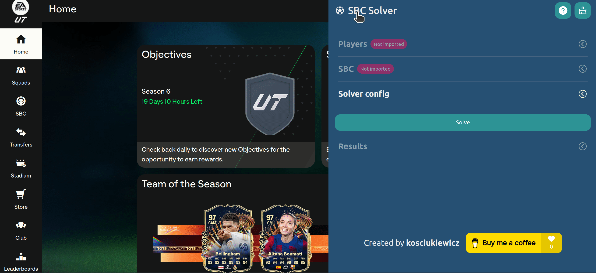
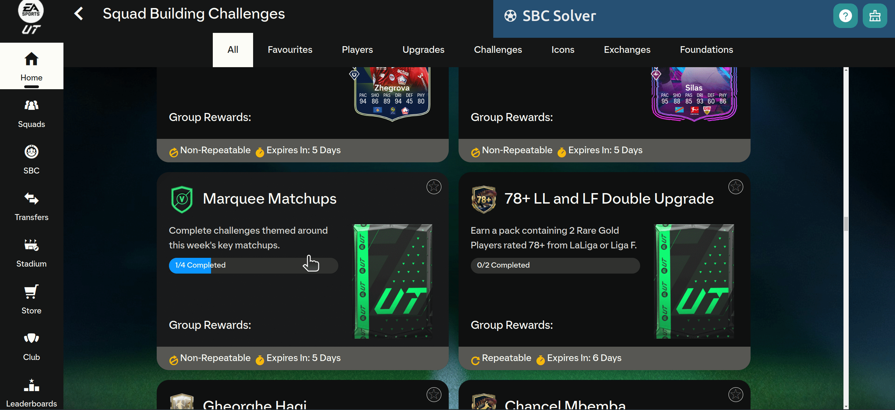
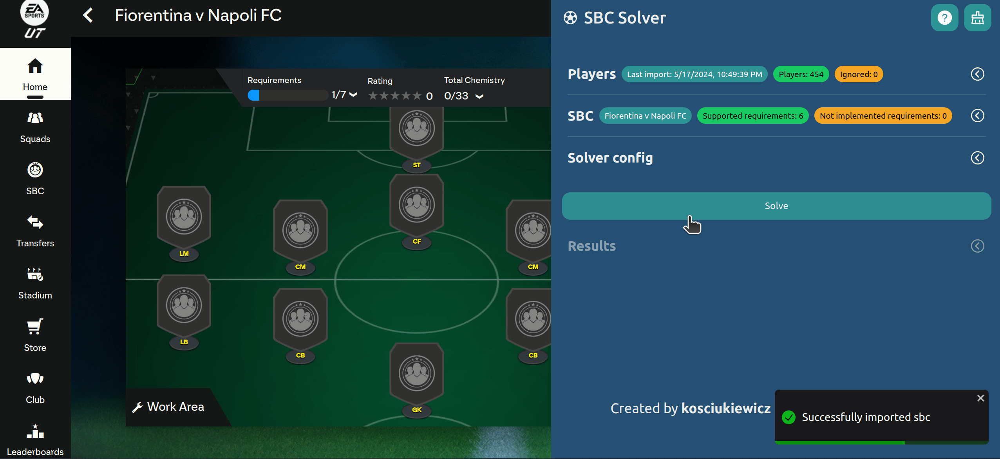

# EA FC SBC Solver ⚽

This project is an automatic solver designed to tackle squad building challenges (SBCs) from the EA FC 25 game using genetic algorithms.

# 🚨 Disclaimer: Project Not Maintained 🚨

This project is **no longer actively maintained**. Development has been moved and integrated into [FUT Mind](https://futmind.com) and [MyClub](https://myclub.gg/) 🚀. New features are activily developed and will be available only there.

Thank you for your understanding! 🙏

## Main features

- completely free;
- imports club players and SBCs directly from the FUT Web App;
- solves the challanges fast;
- automatically fills the SBC's with selected solutions in seconds;
- allows to block the use your most valuable cards in the generated solutions;
- conveniently packaged into a Chrome extension built with React and Tailwind CSS;
- optimization engine is written in Rust ⚙️ and packed into the wasm package that runs on the client side (browser);

The code for the optimization engine is planned to be published in the near future 🚀.

## Using the extension

Weather you downloaded and extracted the zip from releases page or built it yourself you can use the extension in chrome browser.

1. **Open Chrome Extension Management Page:**

   - Open Google Chrome browser.
   - Type `chrome://extensions/` in the address bar and press Enter.

2. **Enable Developer Mode:**

   - In the top-right corner of the Extensions page, you will see a toggle switch labeled “Developer mode”. Turn it on.

3. **Load Unpacked Extension:**

   - Click the "Load unpacked" button on the top-left corner of the page.

4. **Select the chrome extension directory:**

   - A file dialog will open. Navigate to the directory where your project resides.
   - Open the directory containing the built extension

## How to

1. **Import club players:**

   After logging into FUT Web app, got into "Club", the click "Players" and scroll through your cards until the proper notification appear.

   Usually, club import works well directly after logging into the FUT Web App, If it doesn't work for You, please refresh the page and try again.

   <details>
   <summary>click to expand</summary>
   
   </details>

2. **Select SBC to solve:**

   Just select any SBC You want to solve and click "Start challange" or "Go to challange".

   <details>
   <summary>click to expand</summary>
   
   </details>

3. **Solve the selected challange:**

   After successfully importing club players click solve and wait until the solutions are available.

   <details>
   <summary>click to expand</summary>
   
   </details>

4. **Use the generated solution:**

   Select the solution You want to use and click "Use this solution" and wait until the squad is filled.

   <details>
   <summary>click to expand</summary>
   
   </details>

## Setup the Project from Scratch

1. **Install dependencies (using `yarn`):**

   ```bash
   yarn install
   ```

   The `@kosciukiewicz/ea_sbc_solver_engine` npm package is available publicly and connected to this repository. To access github npm registry remember to set up credentials in `~/.npmrc`:

   ```
   //npm.pkg.github.com/:_authToken={YOUR_PERSONAL_ACCESS_TOKEN}
   @NAMESPACE:registry=https://npm.pkg.github.com/
   ```

2. **Set up environment variables:**

   Run the following and fill the missing variables in created files:

   ```bash
   cp .env.example .env.development
   ```

   ```bash
   cp .env.example .env
   ```

3. **Run the development server:**

   ```bash
   yarn start
   ```

4. **Build the chrome extension:**

   ```bash
   ./scripts/build_extension.sh
   ```

   Then you can load the `chrome_extension` directory as chrome browser extension as described in the "Using the extension" section.

## Disclaimer

I do not hold or own any rights to EA Sports' digital property, including player cards or assets. All trademarks and copyrights belong to their respective owners. This solver is a free hobby project intended for community sharing, and no fees are charged for its use.

Use this solver at your own risk. I do not take responsibility for any account bans or suspensions that may result from using this tool. While it is very unlikely to get banned, please be aware of the potential risks involved.

By using the EA FC 25 Squad Builder Solver, you agree to this disclaimer. Thank you for understanding.
